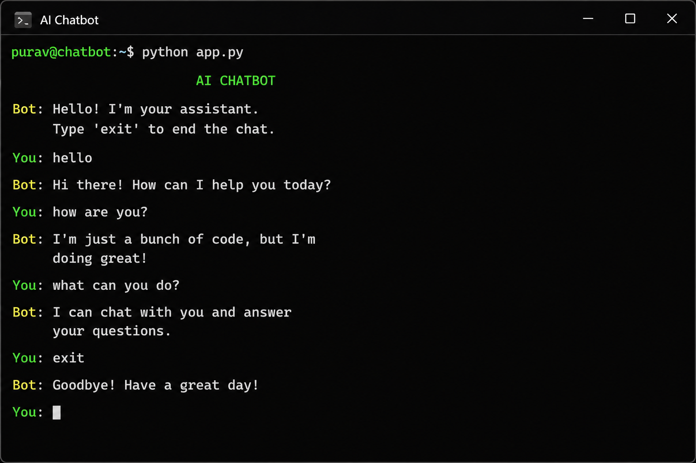

# 🤖 AI Chatbot

> A rule-based conversational chatbot that responds to user input using predefined intents and pattern matching.

---

## 📸 Demo



---

## ✨ Features

- 💬 Terminal-based interaction
- 🧠 Rule-based intent matching (no ML)
- 📄 JSON-driven response system
- ⚡ Lightweight and easy to extend

---

## 🛠 Tech Stack

- Python
- JSON

---

## ⚙️ How to Run

```bash
cd projects/ai-chatbot
python app.py
