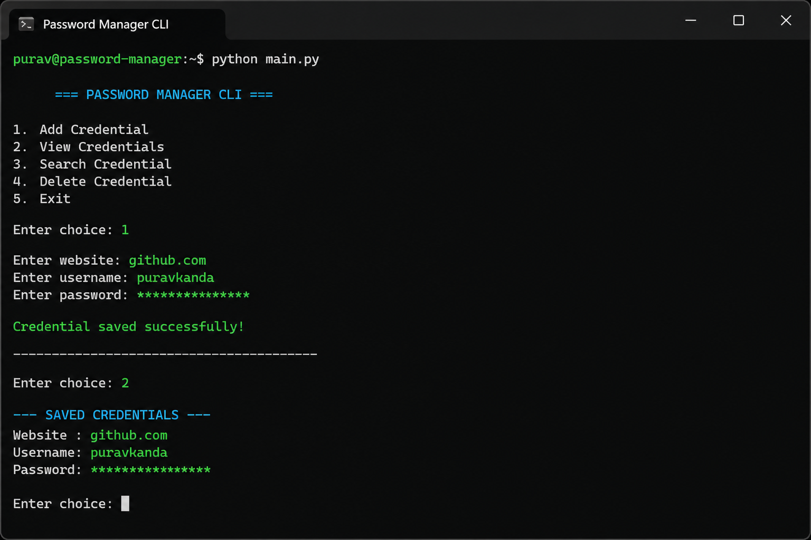

# 🔐 Password Manager CLI

> A secure command-line password manager using PBKDF2, hashing, and salting to protect stored credentials.

---

## 📸 Demo



---

## ✨ Features

- 🔑 Master password authentication  
- 🔐 PBKDF2-based key derivation  
- 🧂 Salted hashing for security  
- 📂 Store, search, and delete credentials  
- 🖥 Terminal-based interface  

---

## 🛠 Tech Stack

- Python  
- PBKDF2 (hashlib / cryptography)  
- File-based storage  

---

## 🚀 Quick Start

### Prerequisites

- Python 3.8+

---

### Installation

```bash
git clone https://github.com/Purav-Kanda/My-Projects.git
cd My-Projects/password-manager-cli
pip install -r requirements.txt
