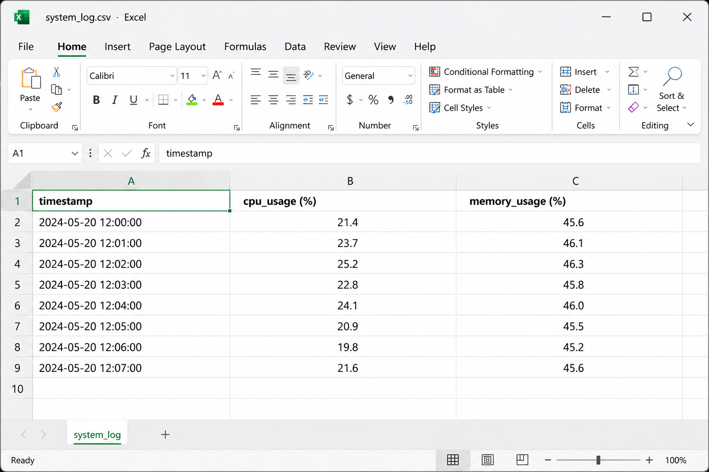

# 📊 System Monitor

> A Python-based system monitoring tool that logs CPU and memory usage into a CSV file for analysis.

---

## 📸 Demo



---

## ✨ Features

- 📈 Tracks CPU usage  
- 🧠 Tracks memory usage  
- 🗂 Logs system data into CSV file  
- ⚡ Lightweight and simple CLI tool  

---

## 🛠 Tech Stack

- Python  
- CSV file handling  

---

## ⚙️ How to Run

```bash
cd projects/system-monitor
python main.py
